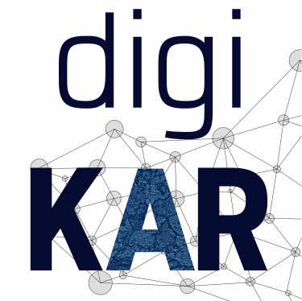

Auf dieser Website werden die im DigiKAR-Projekt entwickelten Ontologie-Entwurfsmuster dokumentiert und zur Nachnutzung bereitgestellt.

- [Katalog der Ontologie-Entwurfsmuster](odp/)
- [Übersicht der eingesetzten Wissensorganisationssysteme](kos/)
