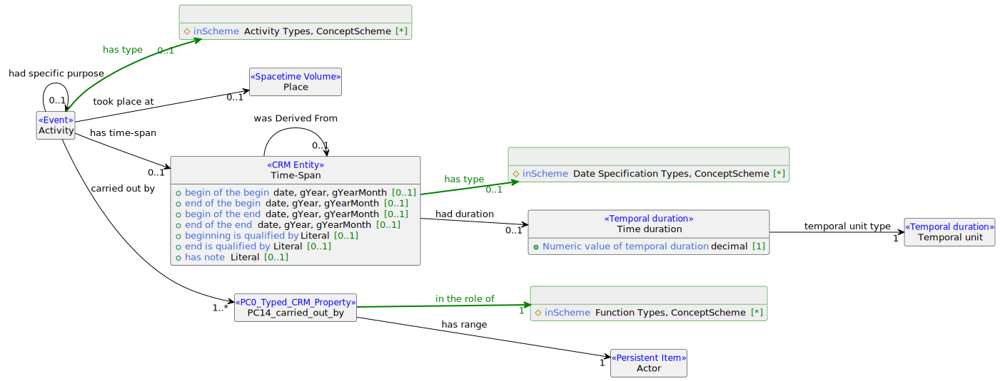

## Schema-Diagramm




## Beispieldaten

Auszug aus noch nicht vollständig normalisierten Daten (in Bearbeitung):

```turtle
@prefix crm: <http://www.cidoc-crm.org/cidoc-crm/> .
@prefix dct: <http://purl.org/dc/terms/> .
@prefix dmlo: <http://digikar.eu/ontology/> .
@prefix foaf: <http://xmlns.com/foaf/0.1/> .
@prefix rdfs: <http://www.w3.org/2000/01/rdf-schema#> .

<http://digikar.eu/resource/person/jahns_P-095> a crm:E21_Person ;
    rdfs:label "Kaspar Anton (Freiherr von) Albini" ;
    dct:identifier "P-095" ;
    crm:P02i_is_range_of <http://digikar.eu/resource/activity/41cd15c0-67f7-49e2-bc36-6a4ec4b364f3/person_role>> ; ;
    foaf:name "Kaspar Anton (Freiherr von) Albini" .

<http://digikar.eu/resource/activity/41cd15c0-67f7-49e2-bc36-6a4ec4b364f3> a crm:E7_Activity ;
    rdfs:label "Jahns_000519" ;
    dct:identifier "Jahns_000519" ;
    dct:provenance "jahns" ;
    dct:type "Graduation" ;
    crm:P01i_is_domain_of <http://digikar.eu/resource/activity/41cd15c0-67f7-49e2-bc36-6a4ec4b364f3/person_rel_role_1>,
        <http://digikar.eu/resource/activity/41cd15c0-67f7-49e2-bc36-6a4ec4b364f3/person_role> ;
    crm:P2_has_type "Graduation" ;
    crm:P4_has_time-span <http://digikar.eu/resource/activity/41cd15c0-67f7-49e2-bc36-6a4ec4b364f3/time> ;
    crm:P7_took_place_at <http://digikar.eu/resource/place/1ff97f22292e3d91119e867aadcf511b> ;
    foaf:title "Lic. iur." .
    
<http://digikar.eu/resource/activity/41cd15c0-67f7-49e2-bc36-6a4ec4b364f3/person_role> a crm:PC14_carried_out_by ;
    crm:P01_has_domain <http://digikar.eu/resource/activity/41cd15c0-67f7-49e2-bc36-6a4ec4b364f3> ;
    crm:P02_has_range <http://digikar.eu/resource/person/jahns_P-095> ;
    crm:P14.1_in_the_role_of "Student" .
```


## Competency Questions

1. Welche Rolle spielte eine Person in einer sozialen Beziehung?
2. Welche Rolle spielte eine Person in einer beruflichen Tätigkeit?


## SPARQL-Beispielabfragen

Abfrage zur Ermittlung aller Aktivitäten in denen eine Person eine Rolle (Funktion) spielt:

```sparql
PREFIX rdf: <http://www.w3.org/1999/02/22-rdf-syntax-ns#>
PREFIX rdfs: <http://www.w3.org/2000/01/rdf-schema#>
PREFIX crm: <http://www.cidoc-crm.org/cidoc-crm/>

SELECT * WHERE {
  ?activity a crm:E7_Activity .
  ?person_role crm:P01_has_domain ?activity ;
    crm:P02_has_range ?person ;
    crm:P14.1_in_the_role_of ?function .
  ?person a crm:E21_Person .
} 
```


## Hinweise auf ähnliche Entwurfsmuster

- https://docs.swissartresearch.net/pattern/temporal/#agent-role-in-the-activity
- https://docs.swissartresearch.net/et/persons/#social-relations
- [Time indexed participation](http://ontologydesignpatterns.org/wiki/Submissions:Time_indexed_participation)
- [Time indexed person role](http://ontologydesignpatterns.org/wiki/Submissions:Time_indexed_person_role)
- Modellierung der Rollen von Personen in Ereignissen in CRM (RDF) als n-äre Relation: [Roles (SARI)](ttps://docs.swissartresearch.net/pattern/general/#roles)


## Relevante verfügbare Datensätze

- DigiKAR-Datensätze (in Vorbereitung)
- [Die Bischöfe des Alten Reiches nach Erwin Gatz. Basisdaten und Normdaten (Datensammlungen der Germania Sacra. Materialien zur Kirche des Alten Reiches 3), Göttingen 2021.](https://doi.org/10.26015/adwdocs-33)
- [Die Bischöfe des Alten Reiches nach Erwin Gatz. Basisdaten und Normdaten (Datensammlungen der Germania Sacra. Materialien zur Kirche des Alten Reiches 3), Göttingen 2021.](https://doi.org/10.26015/adwdocs-33)
- [Das geistliche Personal des Domstifts Mainz, bearbeitet von der Redaktion der Germania Sacra (Germania Sacra. Prosopographische Studien 4), Göttingen 2022.](https://doi.org/10.26015/adwdocs-2481)
