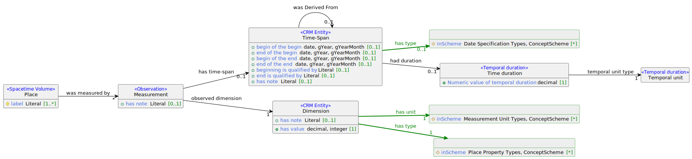

Mit dem Entwurfsmuster können Eigenschaften eines Ortes modelliert werden, die quantitativ erfasst werden können bzw. zu denen es in den Quellen quantitative Angaben gibt (siehe dazu `Place Property Types` im Schema-Diagramm). Exemplarisch dafür ist etwa die Anzahl und Art der Einwohner eines Ortes. Generell wird mit dem Muster auch die Maßeinheit erfasst (siehe dazu `Measurement Unit Types` im Schema-Diagramm). 

## Schema-Diagramm




## Beispieldaten

```turtle
@prefix crm: <http://www.cidoc-crm.org/cidoc-crm/> .
@prefix dct: <http://purl.org/dc/terms/> .
@prefix dmlo: <http://digikar.eu/ontology/> .
@prefix dmlr-document: <http://digikar.eu/resource/document/> .
@prefix dmlr-place: <http://digikar.eu/resource/place/> .
@prefix dmlv-population: <http://digikar.eu/vocabulary/population/> .
@prefix dmlv-measurement: <http://digikar.eu/vocabulary/measurement/> .
@prefix qudt: <http://qudt.org/vocab/unit/> .
@prefix frbroo: <http://iflastandards.info/ns/fr/frbr/frbroo/> .
@prefix owl: <http://www.w3.org/2002/07/owl#> .
@prefix rdfs: <http://www.w3.org/2000/01/rdf-schema#> .

dmlr-place:repsax_1460 a dmlo:Place ;
  rdfs:label "Seylitz" ;
  dct:identifier "repsax_1460" ; 
  crm:P39i_was_measured_by [
    a crm:E16_Measurement ; 
    crm:P2_has_type dmlv-measurement:census ; 
    crm:P40_observed_dimension [
      a crm:E54_Dimension ; 
      # rdfs:label Besessene Mann in Seylitz 
      rdfs:label "Besessene Mann in Seylitz" ;
      crm:P2_has_type dmlv-population:bm ; 
      crm:P90_has_value "6"^^xsd:int ;
      crm:P91_has_unit qudt:Person  
    ] , [ 
      a crm:E54_Dimension ; 
      rdfs:label "Gärtner in Seylitz" ;
      crm:P2_has_type dmlv-population:gr ; 
      crm:P90_has_value "3"^^xsd:int ;
      crm:P91_has_unit qudt:Person 
    ] ; 
    crm:P3_has_note "6 besessene Mann, darunter 3 Gärtner, die sind alle Christoph von Schleinitz zu Grödel lehen- und zinsbar."@de ;  
    crm:P4_has_time-span [ 
      a crm:E52_Time-Span ;
      crm:P81a_end_of_the_begin "1547-01-01"^^xsd:date ;
      crm:P81b_begin_of_the_end "1547-12-31"^^xsd:date 
    ] ; 
    crm:P70i_is_documented_in dmlr-document:repsax 
  ] ; 
  owl:sameAs dmlr-place:hov_10295 .

dmlr-document:repsax a frbroo:F2_Expression ;
  rdfs:label "Repertorium Saxonicum" .
```


## Competency Questions

1. Wie viele Einwohner hatte ein Ort zu einer bestimmten Zeit?
2. Welche Art von Einwohnern hatte ein Ort?


## SPARQL-Beispielabfragen


## Hinweise auf ähnliche Entwurfsmuster

- [RDF Data Cube Vocabulary](http://www.w3.org/TR/vocab-data-cube/)
- [Cube Schema](https://zazuko.github.io/cube-link/)


## Relevante verfügbare Datensätze

- Datenbankdump des [Repertorium Saxonicum (RepSax)](https://repsax.isgv.de/)
