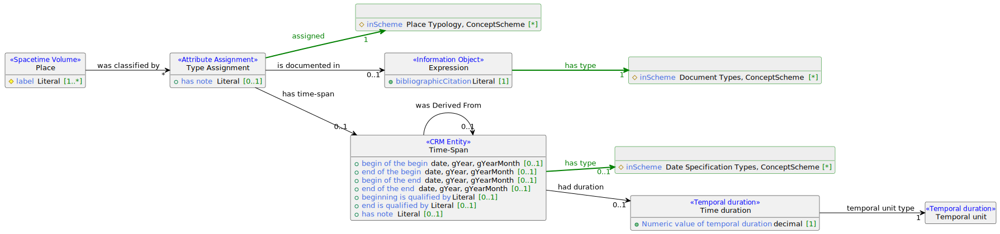

Neben historischen Ortsnamen gehören auch die historischen Ortstypen zu den wesentlichen Eigenschaften, die in einem Gazetteer bereitgestellt werden sollten. Die Angabe eines Ortstyps erfolgt anhand einem Begriff aus dem Klassifikationssystem mit der Ortstypologie (siehe `Place Typology` im Schema-Diagramm).


## Schema-Diagramm




## Beispieldaten

```turtle
@prefix crm: <http://www.cidoc-crm.org/cidoc-crm/> .
@prefix dmlo: <http://digikar.eu/ontology/> .
@prefix dmlr-document: <http://digikar.eu/resource/document/> .
@prefix dmlr-place: <http://digikar.eu/resource/place/> .
@prefix dmlv-place: <http://digikar.eu/vocabulary/place/> .
@prefix frbroo: <http://iflastandards.info/ns/fr/frbr/frbroo/> .
@prefix rdfs: <http://www.w3.org/2000/01/rdf-schema#> .

dmlr-place:hov_10193 a dmlo:Place ;
  rdfs:label "Meißen" 
  crm:P41i_was_classified_by [ a crm:E17_Type_Assignment ;
    crm:P3_has_note "Stadt" ; # Bezeichnung aus der Quelle
    crm:P42_assigned dmlv-place:to ; # Siedlungstyp Stadt
    crm:P70i_is_documented_in dmlr-document:hov ] .
    
dmlr-document:hov a frbroo:F2_Expression ;
  rdfs:label "Digitales Historisches Ortsverzeichnis von Sachsen" .    
```


## Competency Questions

1. Welche Orte sind Siedlungen?
2. Welche Arten von Siedlungen gibt es unter den Orten?
3. Welche Orte sind Verwaltungsgebiete?


## SPARQL-Beispielabfragen

Alle Orte, die als Siedlung klassifiziert sind abfragen:

```sparql
PREFIX skos: <http://www.w3.org/2004/02/skos/core#>
PREFIX crm: <http://www.cidoc-crm.org/cidoc-crm/>
PREFIX dmlo: <http://digikar.eu/ontology/>
PREFIX dmlv-place: <http://digikar.eu/vocabulary/place/>
 
SELECT ?place ?settlement_type WHERE {
  ?place a dmlo:Place .
  ?place crm:P41i_was_classified_by/crm:P42_assigned ?settlement_type .
  ?settlement_type skos:broader dmlv-place:st . 
}

```

Begriffe mit jeweiligen Überbegriffen aus Ortstypologie abfragen:

```sparql
PREFIX dmlv-place: <http://digikar.eu/vocabulary/place/>

SELECT ?node ?parent WHERE {
  ?node skos:inScheme dmlv-place: .
  ?node skos:broader ?parent . 
}
```


## Hinweise auf ähnliche Entwurfsmuster

- [Place Reference Data Model](https://docs.swissartresearch.net/et/place/#names-and-classifications) aus dem Musterkatalog von SARI (Swiss Art Research Infrastructure)
- CRM-Klasse `E17 Type Assignment` zur Typisierung des Orts


## Relevante verfügbare Datensätze

- Datenbankdump des [Historischen Ortsverzeichnisses von Sachsen (HOV)](https://hov.isgv.de/) (Tabelle `2a_siedlungstyp`)
